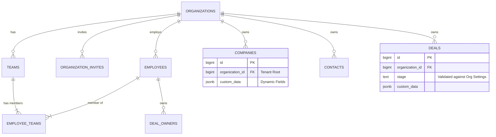

# Atomic CRM - Technical Design Document

## 1. Executive Summary

This document defines the architectural standard for upgrading Atomic CRM to a Multi-Tenant SaaS platform. It prioritizes **Security (Isolation)**, **Performance (Scalability)**, and **Flexibility (Customization)**.

## 2. Architecture & Patterns

- **Tenancy Model**: Shared Database with Row-Level Security (RLS). Code is single-tenant aware; Database enforces isolation.
- **Identity Model**:
  - `auth.users` (Supabase): Global User Identity.
  - `employees`: Tenant-scoped profile linking a User to an Organization.
- **Hierarchy**:
  - `Organization` (Root Tenant)
  - `Teams` (Geographic/Functional Units)
  - `Employees` (Members, can belong to multiple Teams)

## 3. Data Design (Schema)

The core principle is strict referential integrity with JSONB flexibility for customizations.



## 4. Security & Access Control (RLS)

### 4.1 The "JWT Claim" Strategy (Best Practice)

To avoid performance bottlenecks, we will **NOT** query the `employees` table inside every RLS policy.

1. **Login**: Trigger/Function injects `organization_id` into the user's JWT `app_metadata`.
2. **Policy**:

    ```sql
    CREATE POLICY tenant_isolation ON companies
    USING (organization_id = (auth.jwt() -> 'app_metadata' ->> 'organization_id')::bigint);
    ```

    *Result*: Zero-latency permission checks.

### 4.2 The Invitation Flow (Secure Onboarding)

- **Table**: `organization_invites` (Stores `email`, `role`, `token`, `expires_at`).
- **Process**:
    1. Admin invites user -> System generates cryptographically secure token.
    2. User clicks link -> Backend validates token -> Creates `employees` record.
    3. Token is strictly one-time use (deleted on consumption).

## 5. Performance Strategy

### 5.1 Mandatory Indexing

- **Tenant Key**: Every `organization_id` column MUST be indexed.
  - *Why?* To prevent full-table scans during cascading deletes of Organizations.
- **Composite Keys**: Use `(organization_id, email)` instead of just `(email)` for lookups, as the database always filters by tenant first.

### 5.2 JSONB Optimization

- **GIN Indexing**: `CREATE INDEX ON deals USING GIN (organization_id, custom_data)`.
- **Querying**: Use `@>` (contains) operator for efficient filtering of custom fields.

## 6. Coding Standards

### 6.1 Frontend (React-Admin)

- **Context Awareness**: All data providers must automatically inject `organization_id` into creates/updates.
- **Dynamic UI**: Components should check `useOrganizationSettings()` to determine:
  - Which Deal Stages to render.
  - What Labels to show for `custom_data` fields.

### 6.2 Backend (Postgres/Supabase)

- **Types**: Use `BIGINT` for all Foreign Keys (not UUID unless external reference needed).
- **Triggers**: Use triggers for immutable audit logs (e.g., "Deal Created").
- **Migrations**: All schema changes must be idempotent and include `down` migrations.
