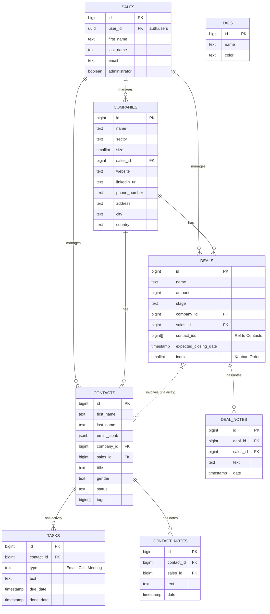

# Atomic CRM - Entity Relationship Diagram

## Schema Notes

- **Sales**: Links to the Supabase Auth user via `user_id`.
- **Contacts**: Emails are stored in `email_jsonb` allowing multiple emails per contact.
- **Deals**: Linked to multiple contacts via the `contact_ids` array column (logical many-to-many).
- **Security**: All tables have Row Level Security (RLS) enabled, generally restricting access to authenticated users.
