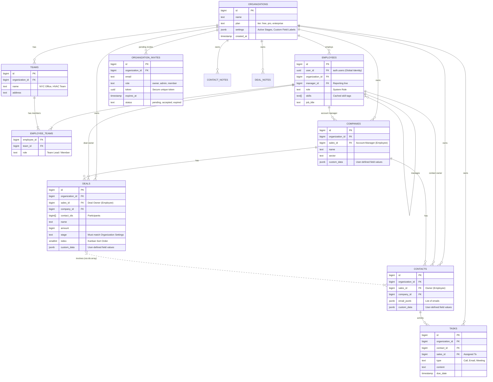

# Atomic CRM - Multi-Tenant ERD (Final)

This diagram represents the complete data structure for the Multi-Tenant system, including:

- **Tenancy**: `organization_id` on all secure resources.
- **Hierarchy**: Organizations -> Teams -> Employees (Many-to-Many).
- **Customization**: JSONB `custom_data` and global `settings`.
- **Onboarding**: Invitation system via `organization_invites`.

